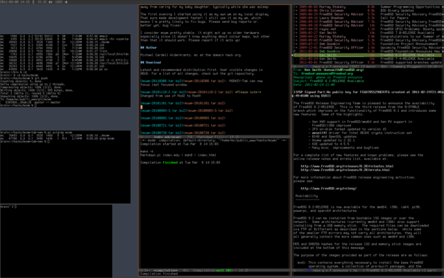

# mcwm

mcwm is minimalist, floating window manager written using XCB, the X
protocol C binding.

The only window decoration is a thin border. All functions can be done
with the keyboard, but moving, resizing, raising and lowering can also
be done with the mouse.

If you don't like the default key bindings, border width, et cetera,
look in the `config.h` file, change and recompile.

See the manual page for how to use it.

## Compiling

As distributed mcwm compiles fine under FreeBSD. If you want to
compile mcwm under Debian-derived GNU/Linux systems you will need
these packages and their dependencies: libxcb1-dev, libxcb-atom1-dev,
libxcb-keysyms1-dev, libxcb-icccm1-dev, libxcb-randr0-dev.

Other system are likely to have similar requirements.

## Screenshot

## Children

mcwm has been forked a few times. It was the beginning of the [2bwm
window manager](https://github.com/venam/2bwm), for instance.

## More information & Contact

Please see:

https://hack.org/mc/projects/mcwm

To contact me, write to:

Michael Cardell Widerkrantz, mc at the domain hack.org.

